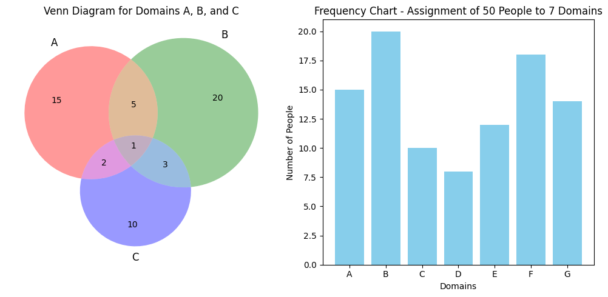
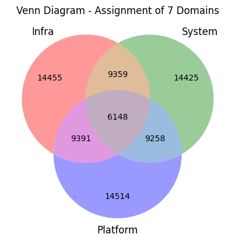

# User Profile Venn Diagrams

This repository contains Python scripts to generate Venn diagrams based on user profiles with different attributes. The scripts use matplotlib and matplotlib-venn to visualize the intersections of sets representing various user attributes.

1. `venn_diagram_user_profiles.py`

This script creates a Venn diagram of user profiles based on 3 predefined sets:
- Set A: Users who completed training.
- Set B: Users who passed a background check.
- Set C: Users who paid the application fee.

The script prints the sets and their intersections, then generates and displays a Venn diagram.

2. `venn_diagram_random_attributes.py`

This script assigns random attributes to a list of users and creates sets based on these attributes:
- Set A: Users with attribute 'A1'.
- Set B: Users with attribute 'A2'.
- Set C: Users with attribute 'A3'.

The script prints the user attributes, sets, and their intersections, then generates and displays a Venn diagram.

3. `venn_and_frequency_chart.py`

This script generates a Venn diagram for three specified domains and a frequency chart for the assignment of people to seven different domains. The Venn diagram illustrates the overlaps between three domains (A, B, and C), while the frequency chart shows the number of people assigned to each of the 7 domains.

- Creates a Venn diagram for three domains (A, B, C) with specified overlaps.
- Plots a bar chart representing the number of people in each of the seven domains.
- Uses matplotlib for plotting and matplotlib-venn for creating the Venn diagram.

4. `venn_diagram_assignment_of_7_domains.py`

This script is designed to create a Venn diagram for the assignment of people to 7 different domains. Since Venn diagrams typically visualize the relationships between up to 3 sets, this script will create multiple Venn diagrams for different combinations of the 7 domains to illustrate their overlaps.

- Generates multiple Venn diagrams for different combinations of the 7 domains.
- Visualizes the overlaps between domains to show the assignment distribution.

