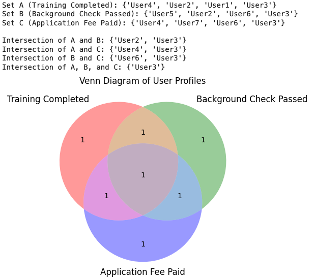
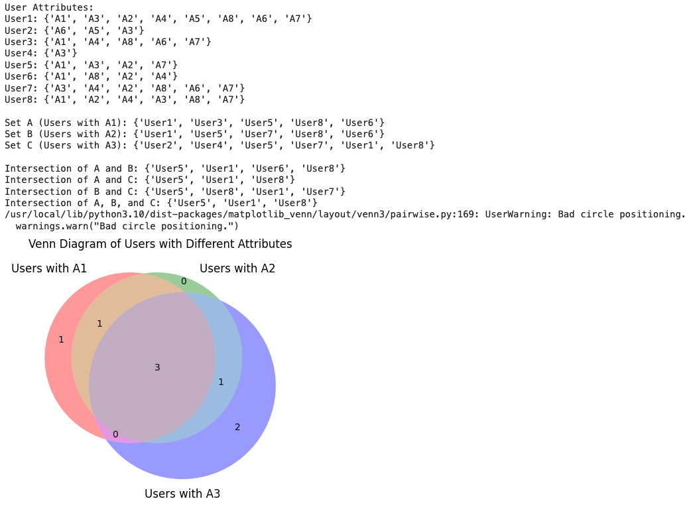

# User Profile Venn Diagrams

This repository contains Python scripts to generate Venn diagrams based on user profiles with different attributes. The scripts use matplotlib and matplotlib-venn to visualize the intersections of sets representing various user attributes.

1. venn_diagram_user_profiles.py

This script creates a Venn diagram of user profiles based on 3 predefined sets:
- Set A: Users who completed training.
- Set B: Users who passed a background check.
- Set C: Users who paid the application fee.

The script prints the sets and their intersections, then generates and displays a Venn diagram.

2. venn_diagram_random_attributes.py

This script assigns random attributes to a list of users and creates sets based on these attributes:
- Set A: Users with attribute 'A1'.
- Set B: Users with attribute 'A2'.
- Set C: Users with attribute 'A3'.

The script prints the user attributes, sets, and their intersections, then generates and displays a Venn diagram.

